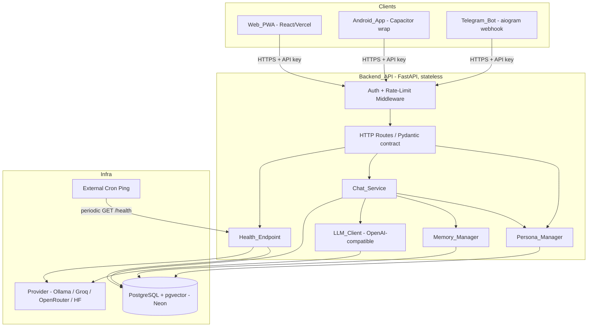
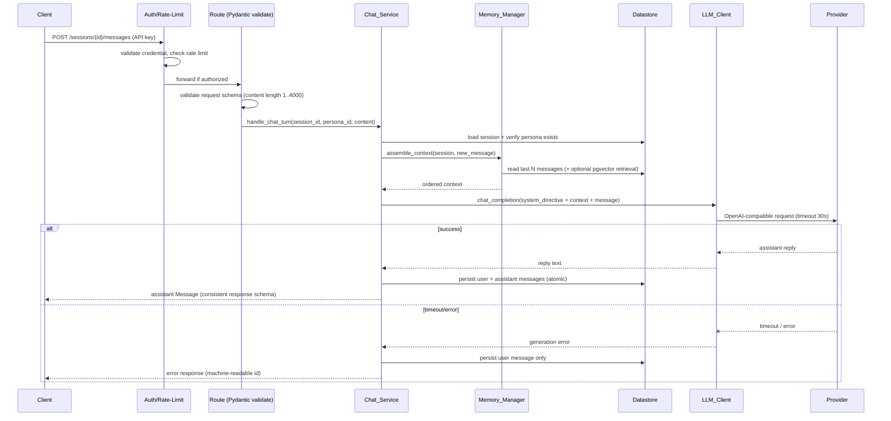
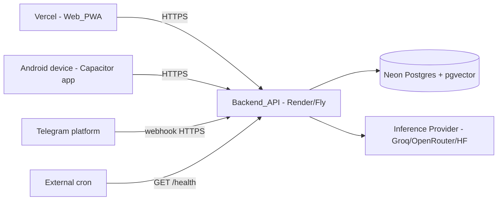

# Design Document

## Overview

Character Chat AI is a single-backend, multi-client product. The central architectural
decision — and the primary defense against bugs and behavioral drift — is that **all
business logic lives in one shared FastAPI backend (Backend_API)**. The three clients
(Web_PWA, Android_App, Telegram_Bot) are deliberately thin: they render UI and forward
user actions to the Backend_API over a single, versioned HTTP contract. No persona
injection, memory assembly, or model routing ever happens in a client. This guarantees
that every client behaves identically because they all execute the same code path on the
server (Requirements 8.8, 9.7, 10.11).

The backend is **stateless**: it holds no conversation state in process memory. Every
Session, Message, Persona association, and embedding is persisted in PostgreSQL
(Datastore). This makes the backend safe to restart, redeploy, scale to zero, and resume
from a free-tier cold start with no data loss (Requirements 6.6, 6.7, 12.7).

Language model access is hidden behind the **LLM_Client**, a provider abstraction that
speaks a single OpenAI-compatible interface. The active Provider (Ollama in development;
Groq, OpenRouter, or Hugging Face Dedicated Endpoints in production) is selected entirely
through environment configuration. Swapping providers requires only an env change plus a
restart, never a code change (Requirements 7.1–7.4).

The product is designed to run on $0 free-tier infrastructure: Render or Fly.io for the
backend, Neon for PostgreSQL, Vercel for the web client, and a hosted inference provider.
A Health_Endpoint plus an external cron ping mitigates free-tier cold starts
(Requirements 12.1–12.3, 12.7).

### Design Goals Traceability

| Goal | Requirements | How the design addresses it |
| --- | --- | --- |
| Single source of truth for logic | 8.8, 9.7, 10.11 | One FastAPI backend; clients call HTTP only |
| Survive restarts / cold starts | 6.6, 6.7, 12.7 | Stateless backend, all state in PostgreSQL |
| Swap providers with no code change | 7.1–7.4 | LLM_Client abstraction selected via env |
| Validated, reliable personas | 1.1–1.7 | Pydantic Persona_Schema, validated at startup |
| Stable client contract | 13.1–13.5 | Pydantic request/response models, versioned |
| Secure and within free-tier limits | 11.1–11.7 | API key auth, per-credential rate limit, redaction |
| Reliable on $0 infra | 12.1–12.7 | Health checks, fail-fast config, retry-on-connect |

### Phased Delivery Mapping

- **Phase 1** — Backend_API + Persona_Manager + Chat_Service + Short_Term_Memory + LLM_Client against local Ollama.
- **Phase 2** — Web_PWA (React) against the backend.
- **Phase 3** — Telegram_Bot (aiogram webhook).
- **Phase 4** — Android_App (Capacitor wrap of the React codebase).
- **Phase 5** — Production hardening (auth, rate limiting, health, deployment) + optional Long_Term_Memory (pgvector RAG).

## Architecture

### System Topology



### Architectural Principles

1. **One backend, thin clients.** Clients never replicate logic. Any behavior that must
   be consistent across clients lives only on the server (Requirements 8.8, 9.7, 10.11).
2. **Statelessness.** Request handlers read and write the Datastore; no in-process session
   cache is the source of truth. A restart loses nothing (Requirements 6.6, 6.7, 12.7).
3. **Fail-fast configuration.** Missing or invalid configuration (provider, credentials,
   datastore, rate limits) aborts startup or forces the Health_Endpoint into an error
   state rather than serving in a broken state (Requirements 7.5, 11.6, 12.5, 12.6).
4. **Explicit boundaries.** Each component (Persona_Manager, Chat_Service, Memory_Manager,
   LLM_Client, persistence, middleware) has a single responsibility and a typed interface.
5. **Provider neutrality.** The Chat_Service depends on the LLM_Client interface, not on
   any specific provider SDK (Requirements 7.1–7.4).

### Request Lifecycle (Chat Turn)



### Technology Choices

- **FastAPI** — async, native Pydantic integration for the request/response contract
  (Requirements 13.1–13.4), automatic OpenAPI documentation.
- **PostgreSQL + pgvector (Neon)** — relational persistence for sessions/messages plus
  vector similarity for optional Long_Term_Memory (Requirements 5.1, 5.2, 6.x).
- **SQLAlchemy (async) + Alembic** — typed ORM models and migrations, including the
  pgvector column type.
- **httpx** — async HTTP client used inside LLM_Client to call any OpenAI-compatible
  endpoint with a strict per-request timeout (Requirements 7.6, 3.6).
- **React + Vite (PWA) wrapped by Capacitor** — one frontend codebase serves both Web_PWA
  and Android_App (Requirements 9.1, 9.2).
- **aiogram (webhook mode)** — Telegram_Bot integration (Requirement 10.1).

## Components and Interfaces

### Auth + Rate-Limit Middleware

Responsible for protecting endpoints before any handler runs (Requirements 11.1–11.7).

- Extracts the API_Credential from the `Authorization: Bearer <key>` header (or
  `X-API-Key`).
- Rejects requests without a valid credential with a `401` unauthorized error
  (Requirement 11.2).
- Tracks a request count per credential within a configurable time window. When the count
  exceeds the threshold, returns `429` including seconds remaining until window reset
  (Requirements 11.3, 11.4).
- Reads credentials, threshold (max requests), and window (seconds) from environment;
  refuses to serve protected endpoints if any is missing/invalid (Requirements 11.5, 11.6).
- The rate-limit counter is stored in the Datastore (or a Postgres-backed counter table)
  keyed by credential + window bucket, so limits survive restarts and remain correct on a
  stateless backend.

```python
class RateLimitState:
    credential_id: str
    window_start: datetime        # start of the current fixed window
    count: int                    # requests observed in the window
    # remaining_seconds computed as window_seconds - (now - window_start)
```

Interface (conceptual):

```python
async def authorize(request) -> AuthContext: ...        # raises Unauthorized
async def enforce_rate_limit(cred_id: str) -> None: ...  # raises RateLimited(retry_after_s)
```

### Persona_Manager

Loads, validates, and serves Personas (Requirements 1.x, 2.x).

- At startup, loads all configured Persona definitions (from bundled JSON/YAML files or a
  configured directory) and validates each against the Persona_Schema (Pydantic model)
  before the backend serves any chat request (Requirements 1.3, 1.6).
- A definition that fails validation is rejected individually; previously validated
  definitions are retained, and a validation error names each missing/invalid field
  (Requirement 1.4).
- Duplicate ids cause **all** definitions sharing that id to be rejected, with an error
  naming the conflicting id (Requirement 1.5).
- If any configured definition fails validation at startup, the manager places the backend
  in a state that refuses chat requests and reports each failing definition
  (Requirement 1.7).
- Serves persona listings with id/name/archetype only, never the system_directive
  (Requirements 2.1, 2.2), and returns an empty list when none exist (Requirement 2.3).
- Resolves a persona by id for selection and chat; unknown ids produce an identifying error
  (Requirements 2.5, 2.6).

```python
class PersonaManager:
    def load_and_validate(self, raw_defs: list[dict]) -> LoadResult: ...
    def list_personas(self) -> list[PersonaSummary]: ...   # id, name, archetype
    def get(self, persona_id: str) -> Persona | None: ...
    @property
    def ready(self) -> bool: ...                           # False if startup validation failed

class LoadResult:
    loaded: list[Persona]
    rejected: list[PersonaValidationError]   # field-level reasons, duplicate-id conflicts
    ok: bool
```

### Chat_Service

Orchestrates a single chat turn (Requirements 3.x).

1. Validates the inbound message (non-empty, ≤ 4000 chars). Invalid messages are rejected
   without persistence or LLM invocation (Requirement 3.5).
2. Verifies the target persona exists; unknown persona id returns an error and does not
   create/modify a session (Requirement 2.6).
3. Asks Memory_Manager to assemble context (system_directive + example_dialogue +
   speech_patterns + ordered memory + new message) (Requirements 3.1, 3.2).
4. Calls LLM_Client with a 30-second timeout (Requirements 3.6, 7.6).
5. On success, persists **both** the user and assistant messages atomically and returns the
   assistant message (Requirements 3.3, 3.4).
6. On failure/timeout, persists **only** the user message and returns a generation error
   (Requirement 3.7).

```python
class ChatService:
    async def handle_turn(
        self, session_id: str, persona_id: str, content: str
    ) -> ChatTurnResult: ...   # raises ValidationError, PersonaNotFound, GenerationError
```

### Memory_Manager

Manages short-term and optional long-term memory (Requirements 4.x, 5.x).

- **Short_Term_Memory**: returns the most recent N messages for the session, ordered oldest
  to newest. N is read from env, default 20, valid range 1–100. An invalid configured value
  is rejected, falls back to 20, and is logged as an error (Requirements 4.1–4.6).
- **Long_Term_Memory** (config-gated): when enabled, on persistence it generates an
  embedding via nomic-embed-text and stores it with pgvector (Requirement 5.1). On
  assembly, it retrieves up to 10 messages with similarity ≥ 0.75, ordered most-to-least
  similar (Requirement 5.2). If none qualify, only Short_Term_Memory is used
  (Requirement 5.3). When disabled, only Short_Term_Memory is used (Requirement 5.4).
- Embedding failures are non-fatal: the chat turn continues with Short_Term_Memory, the
  message is retained, and a failure entry naming the message is recorded (Requirement 5.5).

```python
class MemoryManager:
    def effective_n(self) -> int: ...                       # validated, default 20
    async def short_term(self, session_id: str) -> list[Message]: ...   # oldest..newest, ≤ N
    async def long_term(self, session_id: str, query: str) -> list[Message]: ...  # ≤10, sim≥0.75
    async def assemble(self, session_id: str, new_message: str) -> AssembledContext: ...
    async def maybe_embed_and_store(self, message: Message) -> None: ...  # non-fatal on failure
```

### LLM_Client

Single provider abstraction over an OpenAI-compatible interface (Requirements 7.x).

- Reads active provider, base URL, model name, and API_Credential from env at startup;
  missing/empty required values abort startup and report each missing name
  (Requirements 7.2, 7.5).
- Exposes `chat_completion` and `embeddings`, both using the OpenAI-compatible request
  shape regardless of provider (Requirement 7.1).
- Enforces a 30-second timeout; on timeout returns an "unreachable provider" error while the
  backend keeps running (Requirement 7.6).
- On `401/403` from the provider, returns an authentication-failure error without retrying
  (Requirement 7.7).
- For Ollama, routes chat to the local Ollama service and embeddings to nomic-embed-text
  (Requirement 7.4).

```python
class LLMClient:
    async def chat_completion(self, messages: list[ChatMsg], **opts) -> str: ...
    async def embeddings(self, text: str) -> list[float]: ...
    # raises ProviderTimeout, ProviderAuthError, ProviderError
```

### Persistence Layer

Async SQLAlchemy repositories over PostgreSQL (Requirements 6.x).

- All session/message/embedding reads and writes go through repositories; no module keeps
  conversation state in memory (Requirement 6.6).
- Message persistence for a turn is **atomic**: a failure leaves no partial writes and
  returns a persistence error (Requirement 6.3).
- History is returned oldest-to-newest by timestamp, ties broken by ascending insertion id
  (Requirement 6.4).

### Health_Endpoint

`GET /health` reports liveness including Datastore and Provider reachability
(Requirements 12.1–12.3). Returns success within 2 seconds when all dependencies are
reachable; otherwise an error status naming the unavailable dependency. Also reflects a
configuration-error state when required env values are missing (Requirements 12.5, 12.6).
An external cron pings this endpoint to keep the free-tier instance warm (Requirement 12.7).

## Data Models

### Persona_Schema (validated, not stored in the relational DB)

Personas are defined in configuration files and validated at startup via Pydantic.

```python
class Persona(BaseModel):
    id: str = Field(min_length=1, max_length=64)
    name: str = Field(min_length=1, max_length=200)
    archetype: str = Field(min_length=1, max_length=200)
    system_directive: str = Field(min_length=1, max_length=8000)
    example_dialogue: list[DialogueExample] = Field(min_length=1)  # non-empty
    speech_patterns: list[str] = Field(min_length=1)               # non-empty
```

Validated against Requirements 1.1 (presence + non-empty) and 1.2 (length constraints).
`PersonaSummary` (id, name, archetype) is the listing projection that excludes
system_directive (Requirements 2.1, 2.2).

### Relational Schema

```mermaid
erDiagram
    CHARACTERS ||--o{ SESSIONS : "selected in"
    SESSIONS ||--o{ MESSAGES : contains
    MESSAGES ||--o| EMBEDDINGS : "has optional"
    SESSIONS ||--o| TELEGRAM_MAP : "mapped by chat_id"

    CHARACTERS {
        string id PK
        string name
        string archetype
        text system_directive
    }
    SESSIONS {
        uuid id PK
        string persona_id FK
        string owner_key
        timestamptz created_at
    }
    MESSAGES {
        bigserial id PK
        uuid session_id FK
        string role
        text content
        string persona_id
        timestamptz created_at
    }
    EMBEDDINGS {
        bigint message_id PK_FK
        vector embedding
        timestamptz created_at
    }
    TELEGRAM_MAP {
        string chat_id PK
        uuid session_id FK
    }
```

Notes:

- **characters** is an optional projection of validated personas used for referential
  integrity and listings; the authoritative persona definition remains the validated config
  (Requirement 1.x). The `persona_id` stored on sessions/messages records the association
  (Requirements 2.4, 6.2).
- **sessions.id** is a unique identifier (UUID) created when a conversation begins
  (Requirement 6.1). `owner_key` ties a session to a user/credential or Telegram chat.
- **messages** stores role, content, associated persona id, and timestamp (Requirement 6.2);
  `id` is a monotonic bigserial used as the insertion-order tiebreaker (Requirement 6.4).
- **embeddings** holds the pgvector representation for Long_Term_Memory; the row exists only
  when Long_Term_Memory is enabled and embedding succeeds (Requirements 5.1, 5.5).
- **telegram_map** maps a Telegram chat_id to a session (Requirements 10.2, 10.3).

### API Contract (Pydantic request/response models)

All clients share one response shape per response type (Requirement 13.3) and one error
shape (Requirement 13.4). Requests are validated before any processing (Requirements 13.1,
13.2).

```python
# Requests
class CreateSessionRequest(BaseModel):
    persona_id: str

class PostMessageRequest(BaseModel):
    content: str = Field(min_length=1, max_length=4000)   # Requirement 3.5

# Responses
class PersonaSummary(BaseModel):
    id: str; name: str; archetype: str                    # Requirement 2.1, 2.2

class MessageResponse(BaseModel):
    id: int; role: str; content: str; persona_id: str; created_at: datetime

class SessionResponse(BaseModel):
    session_id: str; persona_id: str

class HistoryResponse(BaseModel):
    session_id: str; messages: list[MessageResponse]      # oldest..newest (Requirement 6.4)

# Consistent error envelope (Requirement 13.4)
class ErrorResponse(BaseModel):
    error_id: str           # machine-readable, e.g. "persona_not_found"
    message: str            # human-readable, secrets redacted (Requirement 11.7)
    fields: list[FieldError] | None = None   # per-field reasons (Requirement 13.2)
```

### API Endpoint Design

| Method | Path | Purpose | Key requirements |
| --- | --- | --- | --- |
| GET | `/health` | Liveness incl. DB + provider | 12.1–12.3, 12.5, 12.6 |
| GET | `/personas` | List personas (id/name/archetype) | 2.1–2.3 |
| POST | `/sessions` | Create session, associate persona | 2.4, 2.5, 6.1 |
| GET | `/sessions/{id}/history` | Ordered message history | 6.4, 6.5 |
| POST | `/sessions/{id}/messages` | Chat turn | 3.1–3.7 |
| POST | `/telegram/webhook` | aiogram webhook intake | 10.1–10.9 |

Error identifiers are stable, machine-readable strings (e.g. `unauthorized`,
`rate_limited`, `validation_error`, `persona_not_found`, `session_not_found`,
`generation_failed`, `persistence_failed`, `provider_unreachable`, `provider_auth_failed`).
The contract is versioned (e.g. `/v1`), and changes remain backward compatible with
previously published schema versions (Requirement 13.5).

### Provider Abstraction Strategy

The LLM_Client depends only on the OpenAI-compatible request/response shape. A small
`ProviderConfig` read from env selects everything:

```python
class ProviderConfig(BaseModel):
    provider: str            # "ollama" | "groq" | "openrouter" | "hf"
    base_url: str            # OpenAI-compatible endpoint
    chat_model: str
    embed_model: str         # e.g. "nomic-embed-text" for Ollama
    api_credential: str      # may be a placeholder for local Ollama
```

Because all providers expose the same interface, switching providers is purely a config
change followed by a restart (Requirements 7.1–7.3). The Chat_Service and Memory_Manager
never import a provider SDK directly.

### Memory Strategy

- **Short-term** is a deterministic sliding window over persisted messages — no in-memory
  cache — so it is correct after any restart (Requirements 4.1–4.5, 6.6).
- **Long-term** is additive and optional. It augments, never replaces, short-term memory and
  degrades gracefully: disabled by config, or silently skipped when retrieval finds nothing
  or embedding fails (Requirements 5.3–5.5).

### The Three Clients

- **Web_PWA** (React + Vite): character picker + chat view; manifest + service worker for
  installability; retains unsent text on error; contains no business logic
  (Requirements 8.1–8.8).
- **Android_App** (Capacitor wrap of the same React codebase): same functionality, launches
  standalone, no business logic (Requirements 9.1–9.7).
- **Telegram_Bot** (aiogram webhook): maps chat_id ↔ session, presents personas, forwards
  messages, no business logic (Requirements 10.1–10.11).

### Deployment Topology



Backend, database, web host, and inference all sit on free tiers. Fail-fast config checks
at startup plus the Health_Endpoint keep a misconfigured instance from silently serving
broken responses (Requirements 12.4–12.6).

## Correctness Properties

*A property is a characteristic or behavior that should hold true across all valid
executions of a system — essentially, a formal statement about what the system should do.
Properties serve as the bridge between human-readable specifications and machine-verifiable
correctness guarantees.*

These properties target the backend's pure and near-pure logic (persona validation, memory
windowing, ordering, persistence round-trips, config resolution, auth/rate limiting, and
the API contract). External-provider and UI behaviors are covered by example and integration
tests in the Testing Strategy rather than by properties.

### Property 1: Persona validation accepts iff well-formed

*For any* candidate persona definition, validation succeeds if and only if all six fields
(id, name, archetype, system_directive, example_dialogue, speech_patterns) are present and
non-empty and the length constraints hold (id 1–64, name and archetype 1–200,
system_directive 1–8000). Any violation causes rejection.

**Validates: Requirements 1.1, 1.2, 1.3**

### Property 2: Batch loading retains valid and reports invalid fields

*For any* batch of persona definitions with no id collisions, the loaded set equals exactly
the subset that passes validation, and each rejected definition is reported with the
specific missing or invalid fields named.

**Validates: Requirements 1.4**

### Property 3: Duplicate ids reject all conflicting definitions

*For any* batch of persona definitions, every definition whose id is shared by another
definition is rejected, no persona with a conflicting id becomes available, and the
conflicting id is reported.

**Validates: Requirements 1.5**

### Property 4: Persona listing exposes summary fields only

*For any* set of valid personas (including the empty set), the listing returns one entry per
persona containing exactly id, name, and archetype, never the system_directive, and returns
an empty list when there are no personas.

**Validates: Requirements 2.1, 2.2, 2.3**

### Property 5: Persona selection associates and confirms

*For any* session and any existing persona, selecting that persona sets the session's persona
association to that persona and the response confirms the association.

**Validates: Requirements 2.4**

### Property 6: Unknown persona id never mutates state

*For any* session and any persona id that does not exist, both selection and a chat turn
return an identifying error and leave the existing persona association and the session store
unchanged (no session created or modified).

**Validates: Requirements 2.5, 2.6**

### Property 7: Assembled model request contains required persona context and the new message

*For any* persona and any session history, the assembled model request includes the persona's
system_directive, example_dialogue, and speech_patterns, plus the new user message, together
with the short-term memory window (Property 8).

**Validates: Requirements 3.1, 3.2**

### Property 8: Short-term memory is the correctly ordered most-recent-N window

*For any* session history and any valid N, short-term memory contains the most recent
min(len(history), N) messages ordered from oldest to newest: all messages when the history
has N or fewer, otherwise exactly the most recent N.

**Validates: Requirements 4.2, 4.3, 4.4**

### Property 9: Window size N resolves safely from configuration

*For any* configured value of N, the effective N equals that value when it is an integer in
1–100; for any unset, non-integer, or out-of-range value the effective N is the default 20
and an error is recorded.

**Validates: Requirements 4.1, 4.5, 4.6**

### Property 10: Successful turn persists user and assistant messages

*For any* chat turn in which the provider returns a reply, the datastore afterward contains
both the submitted user message and the returned assistant message associated with the
session, and the assistant message is returned to the client.

**Validates: Requirements 3.3, 3.4**

### Property 11: Invalid message is rejected with no side effects

*For any* message content that is empty (including whitespace-only) or exceeds 4000
characters, the turn is rejected with a validation error, nothing is persisted, and the
LLM_Client is not invoked.

**Validates: Requirements 3.5**

### Property 12: Failed generation persists only the user message

*For any* chat turn in which the provider returns an error or exceeds the timeout, the
datastore afterward contains the user message and no assistant message, and a generation
error is returned to the client.

**Validates: Requirements 3.6, 3.7**

### Property 13: Long-term memory embeds every persisted message when enabled

*For any* sequence of persisted messages with Long_Term_Memory enabled and a functioning
embedder, every persisted message has a corresponding stored embedding.

**Validates: Requirements 5.1**

### Property 14: Long-term retrieval respects threshold, ordering, and limit

*For any* embedding store and query with Long_Term_Memory enabled, retrieval returns at most
10 messages, all with similarity at least 0.75, ordered from most to least similar; when no
stored message meets the threshold the assembled context uses only short-term memory.

**Validates: Requirements 5.2, 5.3**

### Property 15: Long-term memory degrades gracefully

*For any* session with Long_Term_Memory disabled, the assembled context equals the
short-term-only assembly; and *for any* message whose embedding generation fails while
enabled, the turn continues using short-term memory, the message is retained in the
datastore, and a failure entry naming that message is recorded.

**Validates: Requirements 5.4, 5.5**

### Property 16: Session creation produces unique persisted identifiers

*For any* number of newly created conversations, each session receives a distinct identifier
and every created session is retrievable from the datastore.

**Validates: Requirements 6.1**

### Property 17: Message persistence round-trip preserves fields

*For any* exchanged message, the persisted record's role, content, associated persona id, and
timestamp equal the submitted values.

**Validates: Requirements 6.2**

### Property 18: Persistence failure is atomic

*For any* turn in which persistence fails, the datastore state equals its pre-turn state with
no partial writes, and a persistence error is returned.

**Validates: Requirements 6.3**

### Property 19: History ordering is deterministic

*For any* set of messages in a session, requested history is ordered by ascending timestamp
with ties broken by ascending insertion id.

**Validates: Requirements 6.4**

### Property 20: Unknown session history never creates a session

*For any* session identifier absent from the datastore, a history request returns a
not-found error and creates no session.

**Validates: Requirements 6.5**

### Property 21: State survives restart unchanged

*For any* set of persisted sessions and messages, a backend instance started fresh against
the same datastore serves every session and message with role, content, associated persona
id, and timestamp unchanged and with no message omitted.

**Validates: Requirements 6.6, 6.7**

### Property 22: Provider configuration resolves from environment

*For any* set of environment values, the resolved provider configuration's provider, base
URL, model name(s), and credential equal the supplied environment values.

**Validates: Requirements 7.2**

### Property 23: Missing required configuration fails fast and names what is missing

*For any* subset of required configuration values (provider config, API_Credential, datastore
connection, or rate-limit threshold/window) that is missing or invalid at startup, the
backend does not serve protected/chat endpoints, the Health_Endpoint reports an error, and
every missing or invalid value is reported by name.

**Validates: Requirements 7.5, 11.6, 12.5**

### Property 24: Authentication is enforced on protected endpoints

*For any* request to a protected endpoint, the request is processed only when it carries a
valid API_Credential; a missing or invalid credential yields an unauthorized error and no
processing occurs.

**Validates: Requirements 11.1, 11.2**

### Property 25: Rate limiting triggers past the threshold with remaining time

*For any* configured threshold and window, requests beyond the threshold within the window
are rejected with a rate-limit error that reports a positive time remaining until the window
resets.

**Validates: Requirements 11.3**

### Property 26: Rate-limit window resets

*For any* credential that has been rate-limited, once its configured window elapses its count
resets to zero and subsequent requests are accepted.

**Validates: Requirements 11.4**

### Property 27: Error responses redact secrets

*For any* error response, the serialized body contains no API_Credential value and no Provider
secret.

**Validates: Requirements 11.7**

### Property 28: Telegram chat_id maps consistently to a session

*For any* Telegram chat_id, an incoming message uses the existing mapped session when one
exists; otherwise a new session is created and the chat_id is mapped to it, and that mapping
is used for subsequent messages.

**Validates: Requirements 10.2, 10.3**

### Property 29: Selecting a persona outside the presented list is rejected

*For any* persona selection that is not in the set presented to the Telegram user, the
selection is rejected and the user is notified that it is invalid.

**Validates: Requirements 10.9**

### Property 30: Health status reflects dependency reachability

*For any* combination of datastore and provider reachability, the Health_Endpoint reports
success only when all checked dependencies are reachable and otherwise reports an error that
names exactly the unreachable dependencies.

**Validates: Requirements 12.3**

### Property 31: Request validation precedes processing and reports each failure

*For any* incoming client request, if it fails structure/required-field/type validation it is
rejected before any session or persona data is created or modified, and the error names each
failing field with the reason it was rejected.

**Validates: Requirements 13.1, 13.2**

### Property 32: Responses conform to the single shared schema

*For any* chat, persona, session, or error response, the response conforms to the single
shared schema for its type; every error response additionally carries a non-empty
machine-readable error identifier and a human-readable description.

**Validates: Requirements 13.3, 13.4**

## Error Handling

All errors return the consistent `ErrorResponse` envelope with a stable, machine-readable
`error_id`, a human-readable `message`, and optional per-field `fields` detail
(Requirements 13.4, 13.2). Secrets are never included (Requirement 11.7).

| Condition | error_id | HTTP | Behavior / requirements |
| --- | --- | --- | --- |
| Missing/invalid credential | `unauthorized` | 401 | Reject before processing (11.1, 11.2) |
| Rate limit exceeded | `rate_limited` | 429 | Include `retry_after_seconds` (11.3) |
| Request schema invalid | `validation_error` | 422 | Per-field reasons, no mutation (13.1, 13.2) |
| Message empty/too long | `message_invalid` | 422 | No persist, no LLM call (3.5) |
| Unknown persona | `persona_not_found` | 404 | No session create/modify (2.5, 2.6) |
| Unknown session | `session_not_found` | 404 | No session creation (6.5) |
| Provider timeout/unreachable | `provider_unreachable` | 502/504 | Persist user msg only (3.6, 3.7, 7.6) |
| Provider auth rejected | `provider_auth_failed` | 502 | No retry (7.7) |
| Generation failed | `generation_failed` | 502 | Persist user msg only (3.7) |
| Persistence failure | `persistence_failed` | 500 | Atomic, no partial writes (6.3) |
| Embedding failure (LTM) | (non-fatal) | 200 | Continue w/ short-term, log entry (5.5) |
| Missing required config | `configuration_error` | startup abort / health error | Name each missing value (7.5, 11.6, 12.5) |

Error-handling principles:

- **Fail fast at startup** for configuration problems; never serve in a half-configured state
  (Requirements 7.5, 11.6, 12.5, 12.6).
- **Degrade gracefully at runtime** for optional features (Long_Term_Memory) so a single
  embedding failure never breaks a chat turn (Requirement 5.5).
- **Atomic writes** for message persistence; a failed turn either persists the agreed subset
  (user-only on generation failure) or nothing on persistence failure (Requirements 3.7, 6.3).
- **Redaction** is applied centrally in the error serializer so no handler can leak a secret
  (Requirement 11.7).

## Testing Strategy

The system uses a dual approach: **property-based tests** for universal backend logic and
**example/integration/smoke tests** for UI, external providers, infrastructure wiring, and
configuration.

### Property-Based Testing

PBT applies to the backend's pure and near-pure logic. The implementation MUST:

- Use the **Hypothesis** library for Python (do not hand-roll property testing).
- Run a **minimum of 100 iterations** per property test.
- Tag each property test with a comment referencing its design property in the form:
  **Feature: character-chat-ai, Property {number}: {property_text}**.
- Implement each correctness property (Properties 1–32) with a **single** property-based test.
- Use **mocks/fakes** for the LLM provider, the embedder, and similarity scoring so property
  tests stay fast and deterministic while still exercising real logic (memory windowing,
  ordering, validation, persistence round-trips). An in-memory or transactional test database
  backs persistence and restart properties.

Generators of note:

- Persona definitions with controllable presence/emptiness/length per field (Properties 1–3).
- Message histories of varying length with controllable and colliding timestamps
  (Properties 8, 19).
- Configuration maps with random missing subsets and invalid N values (Properties 9, 23).
- Embedding stores with mock similarity scores spanning the 0.75 threshold (Property 14).

### Example-Based Unit Tests

For specific behaviors and edge cases not suited to PBT:

- Startup lifecycle: chat refused until persona load completes; invalid startup defs block
  serving (Requirements 1.6, 1.7).
- Timeout and provider-auth behavior with mock providers (Requirements 3.6, 7.6, 7.7).
- Ollama routing of chat vs. nomic-embed-text embeddings (Requirement 7.4).
- Provider-swap via config change with no code change (Requirements 7.1, 7.3).
- DB connection retry: 3 attempts within 30s then health error (Requirement 12.6).

### Integration Tests

- End-to-end chat turn against a real local Ollama instance (Phase 1).
- Health_Endpoint reporting real datastore + provider reachability (Requirements 12.1, 12.2).
- Telegram webhook intake through aiogram in webhook mode (Requirement 10.1).
- Backward-compatibility: a v1 request still accepted after a schema change (Requirement 13.5).

### Client Tests

- **Web_PWA / Android_App** (shared React codebase): component/interaction tests for the
  picker, chat view, empty state, error display with unsent-text retention
  (Requirements 8.1–8.6, 9.2–9.5). Snapshot tests for rendering rather than property tests.
- **PWA installability smoke test**: manifest present and service worker registered
  (Requirement 8.7).
- **Android build smoke test**: Capacitor wrap launches standalone (Requirements 9.1, 9.6).
- **No-business-logic checks**: review/lint ensuring clients contain no persona, memory, or
  model-routing modules (Requirements 8.8, 9.7, 10.11).

### Why PBT Is Not Used Everywhere

UI rendering (React components), PWA/Android packaging, Telegram webhook wiring, real
provider calls, and one-time configuration checks do not have meaningful "for all inputs"
properties and are higher cost to repeat. These are covered by example, snapshot, smoke, and
integration tests instead, consistent with the single-backend principle that keeps all
property-testable logic on the server.
